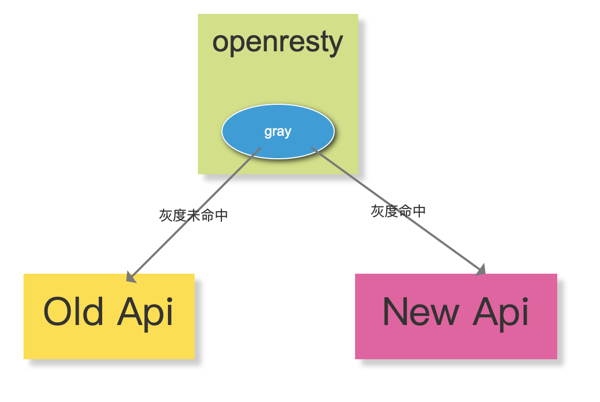
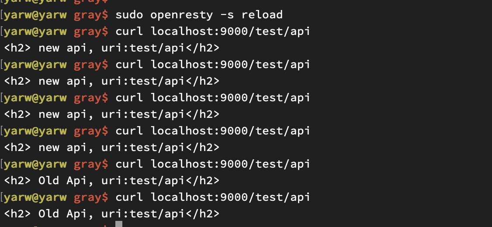

## 基于openresty(nginx+lua)轻量级,按流量控制的灰度模块
---
### 1. 背景
   2年前,我主导图片存储系统服务化重构,由原来的单体架构变为分布式架构,并且需要平滑过渡到新系统,所以gray诞生了(https://github.com/iyw/gray)
最近萌发写一套关于《浅谈千万级系统重构系列》文章,当然少不了灰度发布。review了一下当时写的代码,重新改造了下。
   * 注:该版本去掉了从redis获取配置,因为实际项目中非特殊场景uri都是可以写到配置中的,无需动态获取 *
   
### 2. 安装openresty  
[openresty安装教程]: https://github.com/bytearch/blog/blob/master/src/openresty_install.md)
### 3. 安装gray
```shell script
git clone https://github.com/bytearch/gray.git
cd gray
make install
```

### 4. 配置
* 例如配置5%流量路由到新系统 并且接口为/test/api
* 修改lua配置(/usr/local/openresty/lualib/gray/config.lua)
```lua
   -- Copyright (C) www.bytearch.com (iyw)
   local _M = {
       _VERSION = "0.0.2"
   }
   -- 灰度级别 0: 按流量比转发  1: 100%流量转发到新系统  2: 100%流量转发到老系统
   local proxy_sys_level = 0;
   
   -- 流量控制级别 可调整 当 proxy_sys_level = 0 时生效
   -- 0.01%  new = 1, base = 10000
   -- 0.1%  new = 1, base = 1000
   -- 0.1%  new = 1, base = 100
   -- 10%  new = 10, base = 100
   -- 100% new = 100, base = 100
   local proxy_percent = {
       new = 5, base = 100 
   }
   
   -- 灰度uri配置 此处也可以从配置中心 | redis| 文件 等中获取
   -- 访问 localhost/test/api 命中灰度即可走新系统
   local proxy_uri_list = {
       ["/test/api"] = true
   }
   
   -- ip白名单 该ip 100%转发到新系统(主要为了方便测试)
   local white_ip_list = {
       -- "192.168.0.1"
   }
   -- 100%转发到新系统uri配置 (可能有些接口需要指定转发到新系统)
   local must_proxy_new_uri_list = {
       -- ["/write"] = true,
   }
   --old
   local old_upstream = "proxy_old"
   --new
   local new_upstream = "proxy_new"
   
   _M['proxy_sys_level'] = proxy_sys_level
   _M['proxy_percent'] = proxy_percent
   _M['white_ip_list'] = white_ip_list
   _M['must_proxy_new_uri_list'] = must_proxy_new_uri_list
   _M['proxy_uri_list'] = proxy_uri_list
   _M['old_upstream'] = old_upstream
   _M['new_upstream'] = new_upstream
   return _M
```
### 5 测试
* 安装测试配置
```shell script
make test
```
* 启动openresty
```shell script
##启动
sudo openresty -c /usr/local/openresty/nginx/conf/nginx.conf
##重启
sudo openresty -s reload
```

### 6 其它
* 5%流量,为什么请求4次之后就转换？原因是计数器从1开始计数，这个看看源码就知道了。
* 请求是连续的可能不利于实际场景,计数器这块也可以改成随机数。或者其他策略

### 7 欢迎关注“浅谈架构” 公众号


https://www.jianshu.com/p/bf7f7bfb0639
http://blog.zot24.com/lua-formdata-type/

